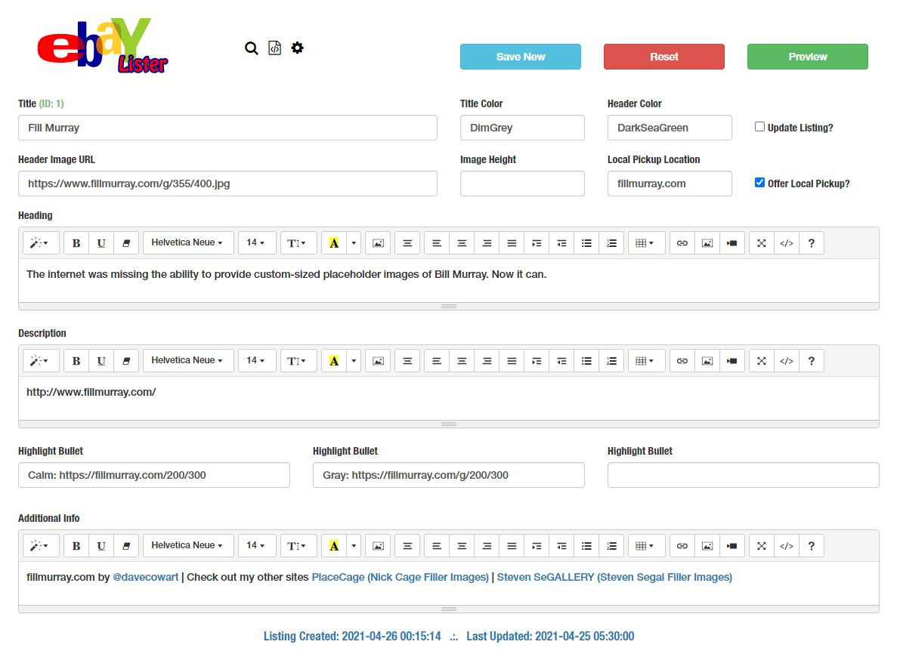

# eBayLister - An eBay Listing Creator

**eBayLister** is a tool for creating quick and easy eBay listings. It's a WYSIWYG template editor that generates styled HTML code you paste into the eBay HTML listing editor. Listings can be stored in the database for later use or modification. This app contains PDO CRUD database functions and additional functionality for storing configuration parameters, changing styles, etc.

eBayLister employs PHP, MariaDB, Javascript, Bootstrap, jQuery, FontAwesome and Summernote.

# Installation

- Upload this repo to a folder your web server
- Create a database for the app in MariaDB
- Open _dbconnect.php_ and enter your database server and login information
- Navigate to _repo_folder/install/_ in your browser
- Click the _Install SQL_ button to install the database
- Click the _Start!_ button and you're ready to go

### 

# Security
This app was designed to run locally, so it's not security friendly and has no sanitization of user inputs, hash/salt of passwords, or other safeguards in place. Deploy remotely at your own risk!

# Copyright

This project is distributed under the **MIT License**. Please see the included **COPYRIGHT** and **LICENSE** for more information.